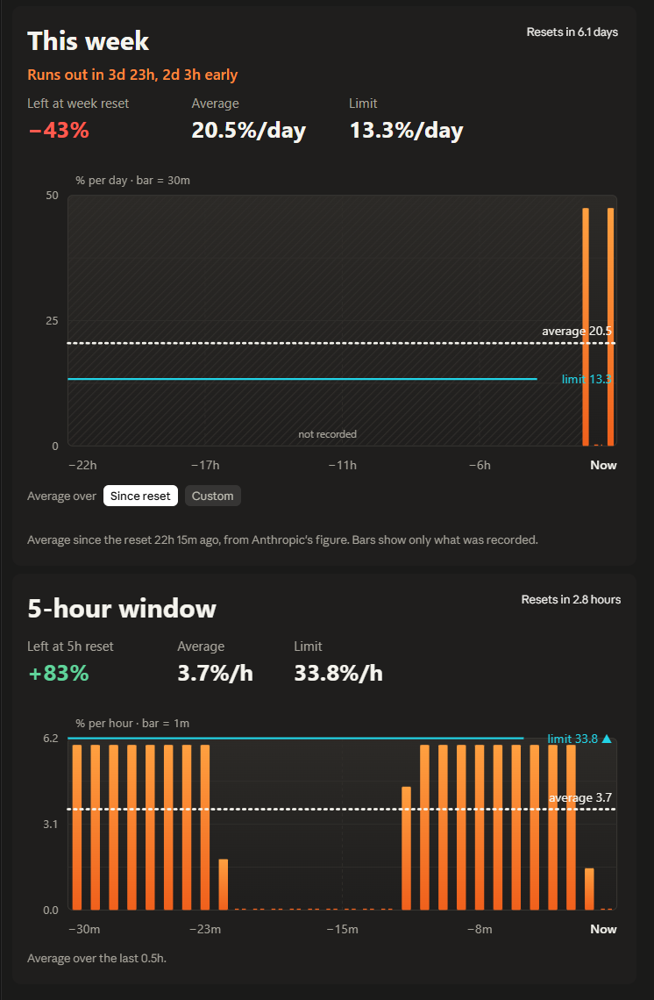

# Token Range Monitor

A Claude Code mod that tells you, like an electric car's range display, whether your current pace will carry you to the next limit reset.

It watches the weekly and 5-hour usage limits of your Claude Pro or Max subscription. It projects what will be left of each one when it resets, if you keep using Claude at the rate you have been.

<!-- Screenshot: add docs/pane.png and uncomment

-->

## Install

In a terminal, start `claude` and run:

```
/plugin install token-range-monitor --marketplace micke-dahlgren/token-range-monitor
```

Answer `y` to add the marketplace, then choose the **user** scope so it runs in every session. It also runs in sessions in the Claude desktop app's Code tab. The install line itself only works in a terminal.

To update later:

```bash
claude plugin update token-range-monitor
```

## What it shows

**Above the prompt**, one line:

> Week **runs out in 2d 9h**, 1d 7h early · 5h **21% to spare**, resets in 2h 24m · Details

- For a limit you'll make it to the reset on, it shows what's projected to be left when it resets, at your current pace, in green: **21% to spare**.
- For a limit you won't, it shows in red when you'd run out, counted from now, and how long before the reset that is.
- In a narrow terminal it shortens to stay on one line: `Week out in 2d 9h · 5h +21% 2h 24m · Details`.
- **Details** opens the pane.

**The pane** has one card per limit, showing:

- **At reset** (what's projected to be left, "21% to spare" or "23% short"), **Your pace** (your average usage rate) and **Safe pace** (the highest rate you can keep up until the reset without running out). When you're over, it also says when you'd run out. In the terminal, where there's no chart, a line compares the two: "Your pace is 1.5× the safe pace."
- **Last window**, small and dim beside them: how the previous window of that limit ended, in the same terms as At reset. **28% to spare** means it reset with 28% unused. **Short** means it ran out early, and is how much more you'd have needed for the time you were locked out, at the pace you'd used it until then. It only shows when the record covers that window's end.
- A chart of your usage over the averaging window, ending at *Now*. The dotted line is your pace and the solid line is the safe pace. If the dotted line is above the solid one, you'll run out before the reset.
- Bars are usage seen as it happened. Anthropic reports each limit in whole percents, so each rise is shared among the responses made since the previous one, by their size. That way the bars follow your actual work and don't all come out one percent high. Stretches the plugin didn't see (before it was installed, or while no session here was getting responses) show as one low block labelled with what's known, like "12% used while away, 9h".
- For the weekly limit, a choice of what the average covers:
  - **Since reset** (the default): your usage since the weekly reset, from Anthropic's own figure. It needs no recorded history, so it works right after you install.
  - **Custom:** the last 1–24 hours or 1–7 days.

A third card, **Models**, shows what each model costs and where your week went:

- **Cost** compares each model token for token with a baseline you pick under **Compare with** (Sonnet by default). "Opus 4.7×" means the same tokens on Opus use 4.7 times as much of your limit as on Sonnet, whether it's a quick answer or a long agentic run. The likely range is shown beneath.
- **This week** splits the % of your weekly limit by model and effort level. Higher effort means more thinking tokens, so it shows here, not in the cost. Usage the plugin didn't see stays apart as **Not recorded**.

Open the pane with `/token-range`. You can also set the window from the prompt: `/token-range 2d`, `/token-range 12h` or `/token-range reset`.

## How the estimate works

Each limit's percentage and reset time arrive with Claude's responses. The mod records them and works out your usage rate over the chosen window:

- **Projected left at reset** = 100% − (used now + rate × time until reset)
- **Safe pace** = what's left ÷ time until reset

The mod shows **No data** rather than a misleading number when there isn't enough behind the average:

- **A custom window needs that much recorded history.** A 2-day average needs 2 days of readings.
- **Weekly estimates need at least 6 hours of data.** The weekly percentage moves in steps of about a point, so over a short stretch a single step reads as a huge rate.
- **Since reset waits 6 hours after each weekly reset.**
- **The 5-hour estimate averages since the window opened,** from Anthropic's own figure, and its chart shows the whole window. It starts 15 minutes after the window opens.

### Model costs

Every response, subagents' included, reports its model, effort and tokens. Between two readings of the 5-hour limit that this computer watched throughout, the mod knows how far the limit rose and which models did the work. Over the last 14 days it solves for each model's weight. It reads the 5-hour limit because it moves several times faster than the weekly one, which gives many more readings to learn from. Models compare the same on either limit, and this week's points are the 5-hour points exchanged at your account's own rate: how many 5-hour points went with each weekly point while this computer was watching. Within a model, output, input and cache tokens are combined at that model's published price ratios, so only the weight across models is learned.

Each model is judged on its own. Its cost shows once the 90% range of its weight is within ±20%. Until then its row shows **Learning** with a meter, and its points this week wait under **Not split yet**. With steady use, Opus usually shows within hours. A cheap model you rarely use, like Haiku in subagents, takes longer.

## Sync across devices

If you use Claude Code on more than one computer, each one only sees the usage it recorded itself; what you did elsewhere shows up as a jump marked "used while away". Sync lets every device see the others' record, so averages, charts, Last window and model costs cover all of your usage. It's off until you sign in.

**Sign in:** at the bottom of the pane, press **Sync across devices · Sign in**. The pane shows a code like `ABCD-EFGH` and a link to the sign-in page. Open the page (in a terminal, copy the address if it isn't clickable), type the code shown in the pane, and choose **Continue with Google** or **Continue with GitHub**. The pane notices within a few seconds and switches to **Synced as you@example.com · last sync 3 min ago**. Do the same on each device, with the same Google or GitHub account (or one with the same verified email). The code is never part of the link: only type a code you got from your own Claude Code, never one someone sent you.

While signed in, each device uploads what it recorded every 10 minutes (only when something changed) and when a session ends, and downloads what the other devices uploaded. Synced data is kept per Claude account, as the local record is, so switching Claude accounts switches the synced record too. If the server can't be reached, the mod carries on with what it has and tries again later; a short note on the row says so.

**What's sent:** the usage-limit percentages and reset times Claude reports, the times your sessions were getting responses, and for each response its time, model, effort level and token counts. Never your prompts, Claude's replies, code, file names or anything else from your sessions. Your Claude account and organization ids are sent so lists from different Claude accounts stay apart; the server stores only a keyed hash of them. Signing in also sends this computer's name, which the server keeps to list your devices. Your email comes from the Google or GitHub sign-in.

**Where:** a small server on Cloudflare (Workers and D1) at `https://token-range-monitor.micke-dahlgren.workers.dev`. Its privacy policy is at [token-range-monitor.micke-dahlgren.workers.dev/privacy](https://token-range-monitor.micke-dahlgren.workers.dev/privacy).

**How long:** each day's list is deleted 15 days after it was last updated, which is also how far back the mod looks (it learns model costs from the last 14 days). A device unused for 90 days is signed out and removed.

**Your devices:** while signed in, the row lists every device linked to your sync account, this one first (**this device**), each other one with when it was last seen. If you see one you don't recognize, press **Remove** next to it, then press again to confirm: it is signed out at once, and the lists it uploaded are deleted from the server and from this computer's view. The list updates when you open the pane and after each sync. Each device sends its computer's name; a device the server has no name for gets one the next time it starts.

**Sign out or delete:** **Sign out** on the row unlinks this device and removes the other devices' data from this computer; your own record stays. **Delete synced data** (press twice to confirm) deletes your sync account with everything stored on the server and signs this device out. Other devices notice the next time they sync.

**Turn it off:** don't sign in, or sign out. While `CLAUDE_CODE_DISABLE_NONESSENTIAL_TRAFFIC` is set, sync is off and the row says so.

**Host your own:** the server's code is in [`server/`](server/), with setup steps in its README. Point the mod at it with the plugin's **Sync server** option (in `/config`, or `pluginConfigs` in your settings), then sign in again.

## Good to know

- **Pro and Max subscriptions only.** API-key usage has no subscription limits to show.
- **History starts when you install it.** Readings are recorded while a Claude Code session is open, and every session on this computer shares them. Usage on claude.ai, or on another device unless you [sync](#sync-across-devices), shows up as a jump at the next reading. The record keeps the last 15 days.
- **It keeps one history per account.** Limits belong to the signed-in account and organization, so signing in to another account switches to that account's own history.
- **Your data stays on your computer** unless you sign in to [sync](#sync-across-devices). It's kept in the mod's own storage in your Claude Code configuration folder. The drawings load the IBM Plex fonts from Google Fonts, and use your system's font where they can't.
- **Built on Claude Code's early-access mod API.** A Claude Code update may change that API and break the mod before it's updated.

## Development

Run it from this folder without installing:

```bash
claude --plugin-dir .
```

Check and test it:

```bash
claude plugin validate .
```

```bash
claude plugin test .
```

## License

MIT
